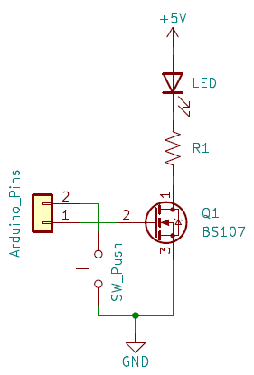

Arduino Reaction Game
=====================

A game where several buttons and associated LEDs are connected to an Arduino;
when an LED lights up the user must press the associated button as quickly as
possible. The score is simply the sum of the reaction times (i.e. lower scores
are better).

- Arduino Uno R4 Minima
- 16x2 I2C LCD display
- Pushbuttons, LEDs, corresponding resistors, and MOSFETs such as BS107
  (Note: the current menus in the game are built on there being a red, green,
  blue, and yellow LED)
- Optional: A speaker driver IC that can play a prerecorded sound.
- For example, https://www.amazon.com/dp/B0BL2K2RKT/ can be modified for this
  purpose (only needs resistors and MOSFETS for LEDs)

Author, Copyright, and License
------------------------------

Copyright © 2023 by Hauke Dämpfling (haukex@zero-g.net).

This program is free software: you can redistribute it and/or modify it under
the terms of the GNU General Public License as published by the Free Software
Foundation, either version 3 of the License, or (at your option) any later
version.

This program is distributed in the hope that it will be useful, but WITHOUT ANY
WARRANTY; without even the implied warranty of MERCHANTABILITY or FITNESS FOR A
PARTICULAR PURPOSE. See the GNU General Public License for more details.

You should have received a copy of the GNU General Public License along with
this program. If not, see <https://www.gnu.org/licenses/>. 
